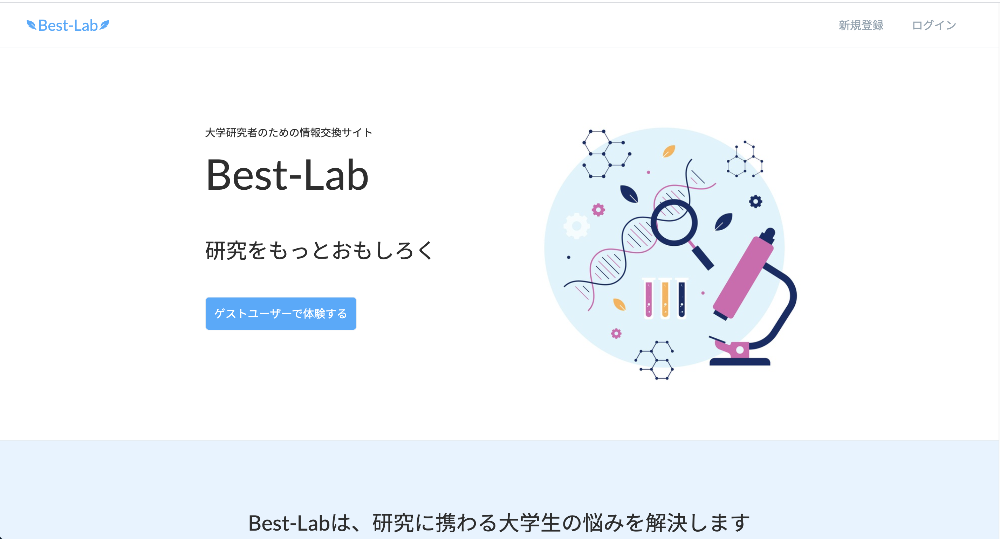

<h1>Best-Lab</h1>

大学研究者のための情報交換サイトです。 
研究に関する質問を投稿し、他のユーザーとメッセージを通じて解決していきます。 
研究内容の盗用が心配な場合は、ダイレクトメッセージを利用いただけます。

（スマートフォンのブラウザからでも閲覧できます）

<h2>URL</h2>

https://best-laboratory.com 
トップページのゲストログインボタンから、メールアドレスとパスワードを入力せずにログインできます。

<h2>使用技術</h2>

<ul>
  <li>Ruby 2.7.1</li>
  <li>Ruby on Rails 6.0.3</li>
  <li>Docker/Docker-Compose</li>
  <ul>
    <li>PostgresQL 11.11</li>
    <li>Nginx 1.18.0</li>
    <li>Puma 4.3.7</li>
  </ul>
  <li>AWS</li>
  <ul>
    <li>ALB</li>
    <li>ECR</li>
    <li>ECS</li>
    <li>RDS</li>
    <li>Route53</li>
    <li>VPC</li>
  </ul>
  <li>CircleCI CI/CD</li>
  <li>Rspec</li>
</ul>

<h2>AWS 構成図</h2>

<h3>CircleCI</h3>

Githubにpush時に、RubocopとESLint、Rspecが自動で実行されます。 
masterブランチにマージした場合は、Rspecのテスト成功後に自動でECSにデプロイされます。

<h2>機能一覧</h2>

<ul>
  <li>ユーザー登録、アカウント有効化、ログイン、パスワードリセット機能（devise）</li>
  <li>ゲストログイン機能</li>
  <li>ユーザープロフィール作成機能</li>
  <li>ユーザープロフィール検索機能(ransack)</li>
  <li>質問掲示板機能</li>
  <ul>
    <li>質問の投稿</li>
    <li>質問への回答(ajax)</li>
    <li>回答に対するリプライ(ajax)</li>
    <li>ベストアンサー(ajax)</li>
  </ul>
  <li>質問検索機能(ransack)</li>
  <li>ダイレクトメッセージ機能</li>
  <li>画像添付機能（*）</li>
  <ul>
    <li>画像の拡大表示</li>
  </ul>
  <li>通知機能（*）</li>
</ul>

( * 質問掲示板、ダイレクトメッセージ共に対応 )

<h2>テスト</h2>

<ul>
  <li>Rspec</li>
  <ul>
    <li>単体テスト（simplecov）</li>
	  <li>機能テスト（simplecov）</li>
    <li>システムテスト</li>
  </ul>
</ul>

<h2>ER図</h2>

<h2>制作の背景</h2>

学生時代に多くの友人が研究室を退学した経験があり、その原因の多くが「周囲からの孤立」だったことから、人と人の交流を活発にすることが大切だと感じました。大学職員としてそういった問題に取り組んだ際に、もっと幅広い人をサポートする仕組みがほしいと感じ、このアプリを制作しました。

